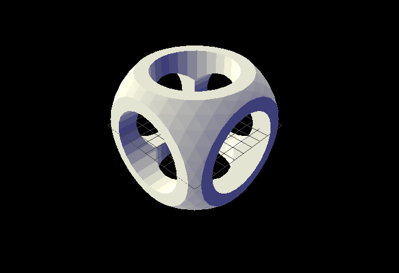
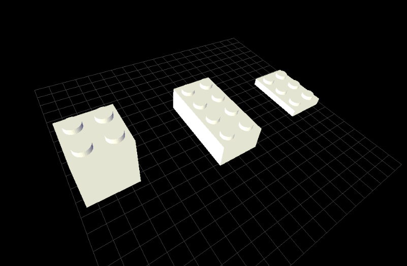

# µcad

[](https://github.com/Rustfahrtagentur/microcad/actions)
[](https://crates.io/crates/microcad-cli)
[](https://docs.rs/microcad-cli/)
[](https://codecov.io/gh/Rustfahrtagentur/microcad)
[](https://deps.rs/repo/github/Rustfahrtagentur/microcad)


µcad (pronounced *microcad*) is a description language for modeling parameterizable geometric objects.
Simple basic shapes can be composed to create complex geometries which then can be rendered into STL or SVG files for 3D printing or CNC milling.

**Note**: This project is in an early stage of development and is not yet feature complete. Feel free to [contribute](#contribute) by opening issues or pull requests.

## Content

- [Content](#content)
- [Quick Start](#quick-start)
- [Hello World example](#hello-world-example)
- [Installation](#installation)
- [Command line usage](#command-line-usage)
- [Documentation](#documentation)
- [Contribute](#contribute)
  - [Get Source Code](#get-source-code)
  - [Get External Libraries](#get-external-libraries)
  - [Build µcad](#build-µcad)
  - [Install µcad locally from source](#install-µcad-locally-from-source)
  - [Contributing to Documentation](#contributing-to-documentation)
    - [User Manual](#user-manual)
- [Test List](#test-list)
- [💚 Funded by](#-funded-by)

## Quick Start

*µcad* is programmed in [Rust](https://www.rust-lang.org/) which easily can be [installed](https://www.rust-lang.org/tools/install) on several operating systems.
You can try it out with an example by using the command line tool `microcad-cli`
which can be installed from [crates.io](https://crates.io) by using `cargo`.

**Note**: Currently µcad has no binary install packages so the only ways to install it are with [`cargo install`](#installation) or from the source code (see section [Contribute](#contribute)).

## Hello World example

The following µcad source code defines a *part* called `csg_cube`, which has a body of a cube with rounded corners and three cylinders as holes:



[](.test/first_example.log)

```µcad,first_example
use std::math::*;
use std::ops::*;
use std::geo3d::*;

part csg_cube(size: Length) {
    body = sphere(r = size / 1.5) & cube(size);
    holes = cylinder(h = size, d = size / 1.5).orient([X,Y,Z]);
    body - holes;
}

csg_cube(50mm);
```

## Installation

First, install [Ninja Build](https://github.com/ninja-build/ninja) which is needed to compile the [manifold geometry library](https://github.com/elalish/manifold).
For example, *Debian* based *Linux* distributions use the following line:

```sh
sudo apt install ninja-build
```

To install the latest release of *µcad* via *cargo*, type:

```sh
cargo install microcad-cli
```

## Command line usage

After installing, you can run a basic example by typing:

```sh
microcad eval ./examples/lego_brick.µcad
```

This will *evaluate* the input file and will output the model tree.
The *evaluate* command will not export the output geometry.

To generate an STL model file use the `export` command with an additional output file name:

```sh
microcad export ./examples/lego_brick.µcad
```

The output file `lego_brick.stl` can be displayed e.g. with [MeshLab](https://www.meshlab.net/).
The resulting STL model looks like this: 

## Documentation

- [Description of language features](doc/README.md)
- [Language reference](doc/REFERENCE.md)
- [Basic concepts](doc/CONCEPTS.md)
- [Examples](doc/EXAMPLES.md)
- Code documentation:
  - [`microcad-lang` module](https://docs.rs/microcad-lang)
  - [`microcad-core` module](https://docs.rs/microcad-core)
  - [`microcad-export` module](https://docs.rs/microcad-export)
- [Glossary](doc/GLOSSARY.md)

## Contribute

We welcome contributions to *µcad*, whether it is a bug report, feature request, or a pull request.

First install [*Git*](https://git-scm.com/book/en/v2/Getting-Started-Installing-Git)
and [*Rust*](https://www.rust-lang.org/tools/install).

### Get Source Code

```sh
git clone https://github.com/Rustfahrtagentur/microcad.git
cd microcad
```

### Get External Libraries

```sh
git submodule init
git submodule update
```

### Build µcad

```sh
cargo build
```

### Install µcad locally from source

```sh
cargo install --path tools/cli
```

### Contributing to Documentation

#### User Manual

The user manual consists of several *markdown* files stored in the `/doc` folder, starting with the inside [`README.md`](doc/README.md).

 One may insert *µcad* code into the *markdown* files, which then will get tested automatically if you run `cargo test` and name them like:

````md
```µcad,my_test
````

The *markdown* will be searched for any *µcad* code and appropriate *rust* tests will be  [generated](https://github.com/Rustfahrtagentur/microcad/tree/master/tests/microcad_markdown_test).

beside the name you may add a test mode (see table below):

````md
```µcad,my_test#fail
````

The tests will create `.test` folders beside the *markdown* files.
The tests will then copy an [image file (`*.png`)](https://github.com/Rustfahrtagentur/microcad/tree/master/tests/images) for every test which signals the test result into the `.test` folder.
They can be included in the *markdown*, if you use this code:

````md

```µcad,my_test
````

| Image                                      | MD Code Type | Mark       | Code                            | What do do?            |
| ------------------------------------------ | ------------ | ---------- | ------------------------------- | ---------------------- |
|                  | `µcad`       |            | succeeds                        | ok                     |
|              | `µcad`       |            | fails                           | fix test or code       |
|        | `µcad`       | `#fail`    | succeeds but should fail        | find out why           |
|        | `µcad`       | `#fail`    | fails intentionally             | ok                     |
|              | `µcad`       | `#todo`    | needs more work to succeed      | create issue/implement |
|      | `µcad`       | `#todo`    | Succeeds but still marked to do | remove `#todo`         |
|  | `µcad`       | -          | Parsing has failed              | fix grammar            |
| -                                          | `µcad`       | `#no-test` | Ignore completely               | yolo!                  |
| -                                          | -            | -          | Ignore completely               | yolo!                  |
| -                                          | *(other)*    | -          | Ignore completely               | yolo!                  |

You may also give the reader access to the logs by clicking on the banner with:

````md
[](.test/my_test.log)
```µcad,my_test
````

## Test List

There is a [list of all tests](doc/test_list.md) included in this documentation.

## 💚 Funded by

Thanks to the [Prototype Fund](https://www.prototypefund.de/) and the [Federal Ministry of Research, Technology and Space](https://www.bmbf.de/EN/) for funding this project in 2025.

<a href="https://prototypefund.de/en/"></a>
&nbsp;&nbsp;&nbsp;&nbsp;&nbsp;&nbsp;&nbsp;
<a href="https://okfn.de/en/"></a>
&nbsp;&nbsp;
<a href="https://www.bmbf.de/EN/"></a>
