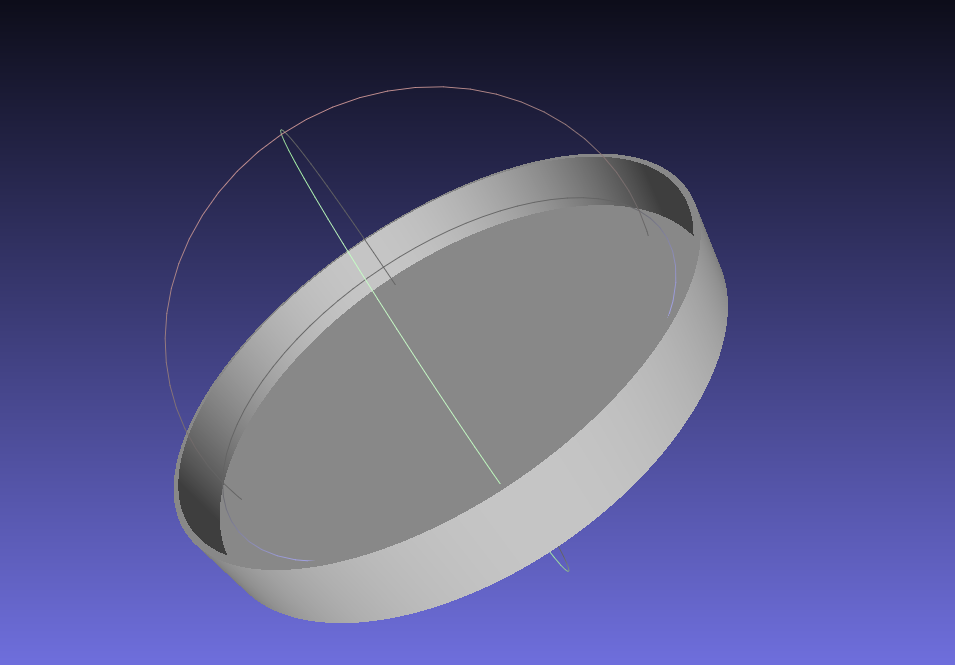

# µCAD

[](https://github.com/Rustfahrtagentur/mcad/actions)
[](https://crates.io/crates/mcad)
[](https://docs.rs/mcad/)
[](https://codecov.io/gh/Rustfahrtagentur/mcad)
[](https://deps.rs/repo/github/Rustfahrtagentur/mcad)

µCAD (pronounced *microcad*) is a description language for modeling parameterizable geometric objects.
Simple basic shapes can be composed to create complex geometries which then can be rendered into STL or SVG files for 3D printing or CNC milling.

## Quick start

You can try out µCAD with an example.
Install µCAD from [crates.io](https://crates.io) by using cargo:

### Installation

```sh
cargo install microcad
```

### Basic example

You can run a basic example by typing:

```sh
µcad eval ./examples/lid.µcad
```

This will *evaluate* the input file and will calculate the volume of the geometry:

```console
Volume: 48.415571412489506cm³
```

The *evaluate* command will not export the output geometry. Instead, it will simply run the program, which prints out the volume.

To generate an STL model file called, use the `export` command with an additional output file name:

```sh
µcad export ./examples/lid.µcad
```

The output file `lid.stl`, can be displayed e.g. with [MeshLab](https://www.meshlab.net/).
The resulting STL model looks like this: 

## Source code explanation

The source file defines a *module* called `lid`, which instantiates two cylinders with different diameters and subtracts them with eachother to generate a round [lid](https://rust.services/blog/20242511-mcad-lid/).

```µCAD
// We have module called `lid` with three parameters
module lid(
    thickness = 1.6mm,
    inner_diameter = 16.0cm,
    height = 20.0mm,
) {
    // Calculate the outer diameter
    outer_diameter = 2.0 * thickness + inner_diameter;

    // Create two cylinders, one for the outer and one for the inner
    outer = std::geo3d::cylinder(d = outer_diameter, h = height);
    inner = std::translate(z = thickness) std::geo3d::cylinder(d = inner_diameter, h = height);

    // Calculate the difference between two translated cylinders and output them
    outer - inner;
}

// `l` is the instance of the lid model
l = lid();

// Print out the volume of the model instance
std::print("Volume: {l.volume() / 1000}cm³");

// Insert `l` into resulting object tree
std::export("lid.stl") l;
```

The program above will print out the following text and export the model to STL.

```console
Volume: 48.415571412489506cm³
```

We can now load the STL with

## Contribute

First install [*Git*](https://git-scm.com/book/en/v2/Getting-Started-Installing-Git)
and [*Rust*](https://www.rust-lang.org/tools/install).

### Get Source Code

```sh
git clone https://github.com/Rustfahrtagentur/microcad.git
cd microcad
```

### Get External Libraries

```sh
git submodule init
git submodule update
```

### Build µCAD

```sh
cargo build
```

### Install µCAD locally from source

```sh
cargo install --path tools/cli
```
