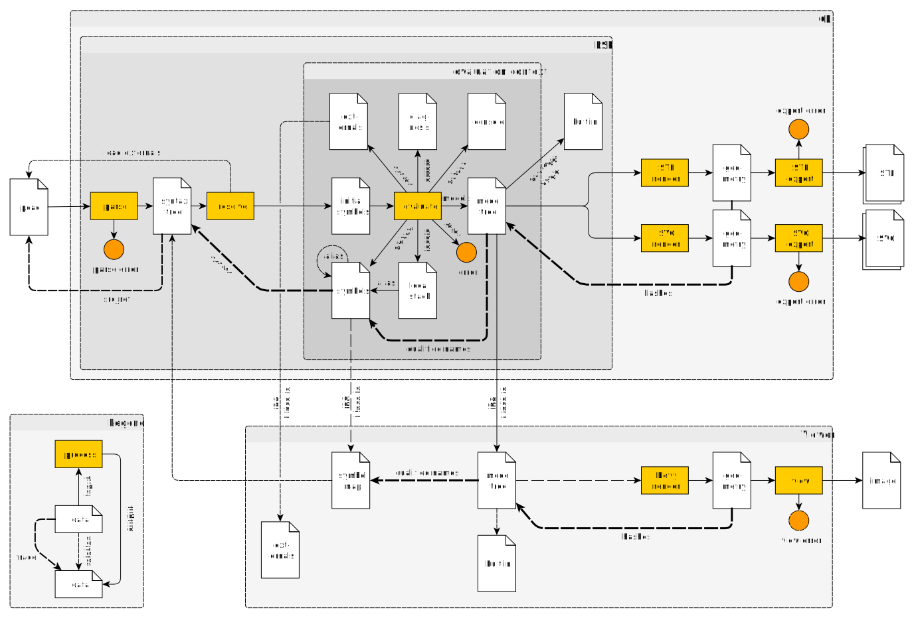

# µcad

[](https://github.com/Rustfahrtagentur/microcad/actions)
[](https://crates.io/crates/microcad-cli)
[](https://docs.rs/microcad-cli/)
[](https://codecov.io/gh/Rustfahrtagentur/microcad)
[](https://deps.rs/repo/github/Rustfahrtagentur/microcad)


µcad (pronounced *microcad*) is a description language for modeling parameterizable geometric objects.
Simple basic shapes can be composed to create complex geometries which then can be rendered into STL or SVG files for 3D printing or CNC milling.

**Note**: This project is in an early stage of development and is not yet feature complete. Feel free to [contribute](#contribute) by opening issues or pull requests.

## Content

- [µcad](#µcad)
  - [Content](#content)
  - [Quick start](#quick-start)
    - [Installation](#installation)
    - [Basic Concepts](#basic-concepts)
      - [parse](#parse)
      - [evaluate](#evaluate)
      - [export](#export)
      - [view](#view)
    - [Basic example](#basic-example)
      - [Source code explanation](#source-code-explanation)
  - [Documentation](#documentation)
  - [Contribute](#contribute)
    - [Get Source Code](#get-source-code)
    - [Get External Libraries](#get-external-libraries)
    - [Build µcad](#build-µcad)
    - [Install µcad locally from source](#install-µcad-locally-from-source)

## Quick start

You can try out µcad with an example using the command line tool (`microcad-cli`)
which can be installed from [crates.io](https://crates.io) by using `cargo`:

### Installation

To install the latest version of µcad via cargo, type:

```sh
cargo install microcad-cli
```

You can also build µcad from source by cloning the repository (see section [Contribute](#contribute)).

### Basic Concepts

The µcad interpreter runs programs which generate geometry files.
The processing of µcad source code files into output files can be divided into separate phases:



#### parse

In the **parse** phase the source files are read with the [grammar](lang/grammar.pest) into the *syntax tree*.
Any errors which occur here are related to file access or syntax.

#### evaluate

In the **evaluate** phase the *syntax tree*  will be processed into the *object node tree*
which is an structured representation of the geometry.
While this pasphases the following things will be done:

- expressions will be calculated
- functions will be called
- modules will generate *object nodes*
- user messages will be output on console

Any errors which occur here are related to semantic issues.

#### export

In the **export** phase the *object nodes* will be taken to generate 2D or 3D output files
(e.g. SVG or STL).
While this phase the following things will be done:

- geometric algorithms will be processed
- geometries will be rendered
- the output files will be written

#### view

The **view** phase generates images which can be shown to visualize *object nodes* (e.g. in an IDE).
Any errors which occur here are related to geometrical processing or file access.

### Basic example

After installing, you can run a basic example by typing:

```sh
microcad eval ./examples/lid.µcad
```

This will *evaluate* the input file and will calculate the volume of the geometry:

```console
Volume: 48.415571412489506cm³
```

The *evaluate* command will not export the output geometry. Instead, it will simply run the program,
which prints out the volume.

To generate an STL model file called, use the `export` command with an additional output file name:

```sh
microcad export ./examples/lid.µcad
```

The output file `lid.stl`, can be displayed e.g. with [MeshLab](https://www.meshlab.net/).
The resulting STL model looks like this: 

#### Source code explanation

The source file defines a *module* called `lid`, which instantiates two cylinders with different diameters and subtract them with each other to generate a round [lid](https://rust.services/blog/20242511-mcad-lid/).


```µcad,first_example
// We have module called `lid` with three parameters
module lid(
    thickness = 1.6mm,
    inner_diameter = 16.0cm,
    height = 20.0mm,
) {
    // Calculate the outer diameter
    outer_diameter = 2.0 * thickness + inner_diameter;

    // Create two cylinders, one for the outer and one for the inner
    outer = std::geo3d::cylinder(d = outer_diameter, h = height);
    inner = std::translate(z = thickness) std::geo3d::cylinder(d = inner_diameter, h = height);

    // Calculate the difference between two translated cylinders and output them
    outer - inner;
}

// `l` is the instance of the lid model
l = lid();

// Print out the volume of the model instance
std::print("Volume: {l.volume() / 1000}cm³");

// Insert `l` into resulting object tree
std::export("lid.stl") l;
```

The program above will print out the following text and export the model to STL.

```console
Volume: 48.415571412489506cm³
```

We can now load the STL into a slicer program like [Cura](https://ultimaker.com/software/ultimaker-cura) and print it on a 3D printer.

## Documentation

- [µcad language](doc/README.md) - description of all language features

## Contribute

We welcome contributions to µcad, whether it is a bug report, feature request, or a pull request.

First install [*Git*](https://git-scm.com/book/en/v2/Getting-Started-Installing-Git)
and [*Rust*](https://www.rust-lang.org/tools/install).

### Get Source Code

```sh
git clone https://github.com/Rustfahrtagentur/microcad.git
cd microcad
```

### Get External Libraries

```sh
git submodule init
git submodule update
```

### Build µcad

```sh
cargo build
```

### Install µcad locally from source

```sh
cargo install --path tools/cli
```
