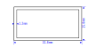

# Creating the frame

The first geometry we want to construct is the frame of the brick's base.
It consists of an outer and an inner rectangle.

The outer frame is a rectangle with a width of 31.8 mm and a height of 15.8 mm.
From that we will derive the inner frame by using a `thickness` as parameter.
