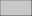

# Creating two rectangles

To construct a rectangle in µcad, we use a sketch with the name `std::geo2d::Rect`.

Open the `lego_brick.µcad` file you have created before, delete all contents and
replace it with the following single statement:

[](.test/rect.log)

```µcad,rect
std::geo2d::Rect(width = 31.8mm, height = 15.8mm);
```



The statement above [calls](../structure/calls.md) a built-in sketch, `std::geo2d::Rect`,
with the parameters `width` and `height` set to our measures.
Like every statement in µcad, it ends with a semicolon (`;`).
Executing this statement will eventually construct the actual geometry.

As you can see, arguments in µcad are quite explicit.
There are **no** positional parameters in µcad!
Instead arguments must be given together with an identifier or match
unambiguously by type.

Like the outer frame, the inner frame is a `std::geo2d::Rect` too:

[](.test/inner.log)

```µcad,inner
thickness = 1.2mm;
std::geo2d::Rect(width = 31.8mm - 2 * thickness, height = 15.8mm - 2 * thickness);
```


We have defined a new value `thickness = 1.2mm` to store the frame's wall thickness.
Then we construct a rectangle by taking the original width and height and subtracting
twice the `thickness` from each.

Now, we are able to output the inner and outer geometry at the same time.
Similar to the `thickness = 1.2mm`, we also assign `width` and `height` their respective
values to shorten the code:

[](.test/inner_outer.log)

```µcad,inner_outer
thickness = 1.2mm;
width = 31.8mm;
height = 15.8mm;
std::geo2d::Rect(width, height);
std::geo2d::Rect(width = width - 2 * thickness, height = height - 2 * thickness);
```


Because the arguments we give to the first `std::geo2d::Rect()` match exactly the parameter
names of it we do not need to write extra parameter names here.
This is called *auto-matching* and prevents us from having to write this:

```µcad
std::geo2d::Rect(width = width, height = height);
```

Now, we can execute the export command from the command line tool:

```sh
microcad export lego_brick.µcad
```

The `export` command will produce a *Scalable Vector Graphic* (SVG) file named `lego_brick.svg`
next to the `lego_brick.µcad` file.
By default, all 2D geometries are exported to *SVG*.

Congratulations, you have exported your first 2D geometry with µcad!

Although the measurements of these rectangles are correct, our intention was to create a
frame where the both rectangles define the boundary of the frame.
To achieve this, we now will use an *operation* to bring them together.
