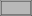

# Subtract

Until now we have two rectangles which are generated within
the same file but to build a frame from this we need to combine them.

## Grouping Statements

The first step is to bundle the rectangles into a group with curly brackets `{}`.
So let's put some around the frame's rectangles.

[](.test/group.log)

```µcad,group
thickness = 1.2mm;
width = 31.8mm;
height = 15.8mm;
{
    std::geo2d::Rect(width, height);
    std::geo2d::Rect(width = width - 2 * thickness, height = height - 2 * thickness);
}
```



As you can see, there is no `;` after the braces.

## Manipulate geometry with *Operations*

Nothing has really changed with the braces, but now we can combine both rectangles
by using an *operation*:

In µcad, the operation to subtract a geometry from one another is called [`subtract`](../libs/std/ops/subtract.md).
In our case, we want to subtract the outer part by the inner part in our frame group:

[](.test/subtract.log)

```µcad,subtract
thickness = 1.2mm;
width = 31.8mm;
height = 15.8mm;
{
    std::geo2d::Rect(width, height);
    std::geo2d::Rect(width = width - 2 * thickness, height = height - 2 * thickness);
}.std::ops::subtract();   // Apply the operation.
```


Now the semicolon is back, because we added the operation.
