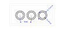

# Creating the struts

Now after we have finished the frame, we can start with the struts.

[Looking at it](https://www.bartneck.de/wp-content/uploads/2019/04/lego-2x4-brick-dimensions-measurements-3001.pdf),
we find three inner and three outer circles with the measures of 4.8 mm and 6.51 mm.
Quite similar to the rectangles we have used in `Frame`, but now there are three times more elements.
