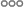

# Ranges

The term `[-1, 0, 1]` can be replaced with a range expression `[-1..2]`, which yields the array we need:

[](.test/ranges.log)

```µcad,ranges
use std::geo2d::*;
use std::ops::*;

(Circle(d = 6.51mm) - Circle(d = 4.8mm)).translate(x = [-1..2] * 8mm);
```



A range expression has the syntax `[m..n]` where `m` and `n` have to be of type `Integer`.

As you might have mentioned µcad ranges differ from ranges in other languages (like Rust):
They include the end value - in Rust you would have to write `[-1..=1]` to achieve the same
if you write `[-1..1]` in µcad.

At this point, we are almost finished with the base.
We just have to find a way to combine frame and structs.

## TODO

Ask people which one is better and more readable in this case: `[-1..2]` or `[-1..1]`
