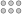

# Sketch caps & knobs

With the knowledge we have gained in the previous chapter,
the remaining sections of the brick (`Cap` and `Knobs`) can be constructed swiftly.

## Cap

The `Cap` is nothing more than a rectangle. We do not have to define a specific `sketch Cap`, instead we can use an *alias*:

[](.test/cap.log)

```µcad,cap
// alias Rect as Cap
use std::geo2d::Rect as Cap;

Cap(width = 31.8mm, height = 15.8mm);
```


`Cap` will now be known as `Rect`.

## Knobs

The knobs of the brick are simple circles with a diameter of `4.8mm`.
We can easily construct a grid with circles via multiplicity:

[](.test/cap_multiplicity.log)

```µcad,cap_multiplicity
std::geo2d::Circle(d = 4.8mm, c = (
        x = ([-1..2] - 0.5) * 8mm, 
        y = ([0..1] - 0.5) * 8mm)
    );
```



Calculating `x` and `y` is a bit tricky here, because we now have no element in the center anymore
so we have to subtract `0.5` from all the array values before multiplying with `8mm` to get a centered result.

To avoid this complication we can use the function `center()` which can be applied to any workbench
and centers the object to origin.

[](.test/cap_center.log)

```µcad,cap_center
std::geo2d::Circle(d = 4.8mm, c = (
        x = [0..3] * 8mm, 
        y = [0..1] * 8mm)
    ).align();
```


The code looks clearer now.

### Tuples

Notice that we have called the `std::geo2d::Circle` with additional argument `c`.
`c` is given as a tuple `(x = ..., y = ...)`. A [tuple](../types/tuples.md) is a collection of (mostly named) values.
The parameter `c` of a circle is supposed to be a tuple of type `(x: Length,y: Length)`.
If we pass to array of `Length` to the tuple, we can generate a multiplicity, which eventually creates `2*4` circles.

[](.test/knobs.log)

```µcad,knobs
sketch Knobs(diameter = 4.8mm) {
    std::geo2d::Circle(d = 4.8mm, c = (x = [0..3] * 8mm, y = [0..1] * 8mm))
        .align();
}

Knobs();
```

