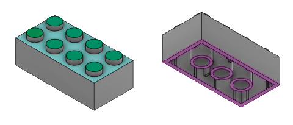

# How to construct a Lego brick

Before designing a fully customizable Lego brick, we will first
construct a brick of
[fixed size](https://www.bartneck.de/wp-content/uploads/2019/04/lego-2x4-brick-dimensions-measurements-3001.pdf)
and make it customizable afterwards.

We will design three components by *extrusion* of the following 2D sketches:

* *Base*: A rectangular frame with struts (purple).
* *Cap*: A rectangular top plate that closes the base structure (cyan).
* *Knobs*: The knobs of a Lego brick placed on top of the cap (green).

After that, we will use the sketches to construct a 3D part of a lego brick.

At last we will put everything together into a proper library.
