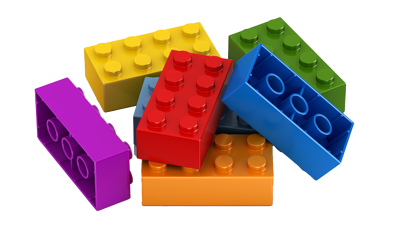

# Lego Brick

This tutorial will introduce you to the basic concepts of the µCAD language.

## Objective

The goal is to create a parametric Lego brick part and provide it as a reusable library.

## Needed Skills

Basic programming and CAD knowledge are required to complete this tutorial.
