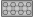

# Putting it together

Below is an intermediate result of the sketches of the three components we now have defined:

[](.test/overview.log)

```µcad,overview
use std::geo2d::*;
use std::ops::*;

const SPACING = 8mm;

sketch Base(width: Length, height: Length) {
    thickness = 1.2mm;
    frame = Frame(width, height, thickness);
    struts = (Circle(d = 6.51mm) - Circle(d = 4.8mm))
        .translate(x = [0..3] * SPACING)
        .align();
    frame | struts;
}

use Rect as Cap;

sketch Knobs() {
    Circle(d = 4.8mm, c = (x = [0..3] * SPACING, y = [0..1] * SPACING)).center();
}

width = 15.8mm;
height = 31.8mm;

Base(width, height);
Cap(width, height);
Knobs();
```



Across the Lego universe, the spacing of `8mm` is used everywhere.
To address this we can store it in global constant named `SPACING` using the `const` keyword.
The name of a constant must be in capital letters.
It can be used within the current module/file and from all sketches & parts in that module.

In the next steps, we want to create a 3D geometry.
