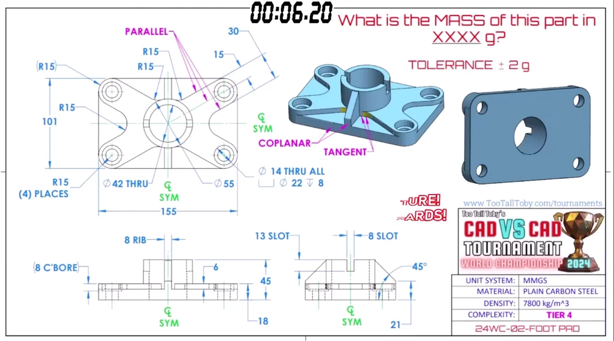

# Challenges

## FootPad



[](.test/challenges_foot_pad.log)

```µcad,challenges_foot_pad
module foot_pad(
    size = (x = 155mm, y = 101mm, z = 55mm),
    r = 15mm,
    socket_diameter = 55mm,
    hole_diameter = 42mm,
    screw_diameter = 14mm,
    slot_width = 8mm,
    plate_height = 18mm,
    )
{
    assert((socket_diameter - hole_diameter) >= 3mm);

    use std::geo2d::circle;
    
    s2 = size.xy / 2;

    module corner_circles(d: length) {
        translate(x = [-s2.x, s2.x], y = [-s2.y, s2.y]) circle(d);
    }

    screws_holes = corner_circles(d = screw_diameter);
    center_hole = circle(d = hole_diameter);

    plate_bottom = std::algorithm::hull() corner_circles(d = 30mm) - screws_holes - center_hole;
    
    plate_top = {    
        union()
            mirror(x = [0,1], y = [0,1]) {
                path = path() {
                    move(x = size.x / 2 - r);
                    move(y = r) arc(r);
                    move(x = size.x / 2 - r, y = size.y / 2 - r) arc(r);
                    move(y = socket_diameter / 2) arc(r);
                    move(0mm,0mm)
                }
            }    
    } - corner_circles(d = 22mm) - center_hole;  

    tube_bottom = (circle(d = socket_diameter) | rect(h = size.z, w = 8mm)) - center_hole;
    tube_top = tube_bottom - rect(w = socket_diameter, h = slot_width);
    
    cutoff = {
        planes = mirror(y = [0,1])
            rotate(x = 45°) std::geo3d::plane(p = (y = -s2.x, z = 21mm, x = 0), n = (z = 1));

        std::algorithm::cutoff(planes, X)
            children();
    }

    use    std::algorithm::extrude;

    cutoff extrude(height = size.z) {
        plate_top_height = 6mm;
        extrude(h = plate_height - plate_top_height) 
            plate_bottom;
        extrude(h = plate_top_height)
            plate_top;
        extrude() 
            tube_bottom;
        extrude(h = 13mm) 
            tube_top;
    }
}

part = foot_pad();

info("Mass in g: {part.mass(density = 7800kg*1m^-3)});
```
